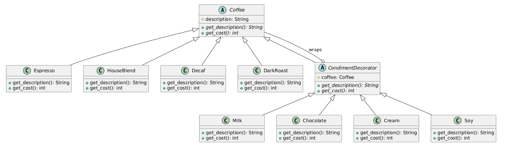
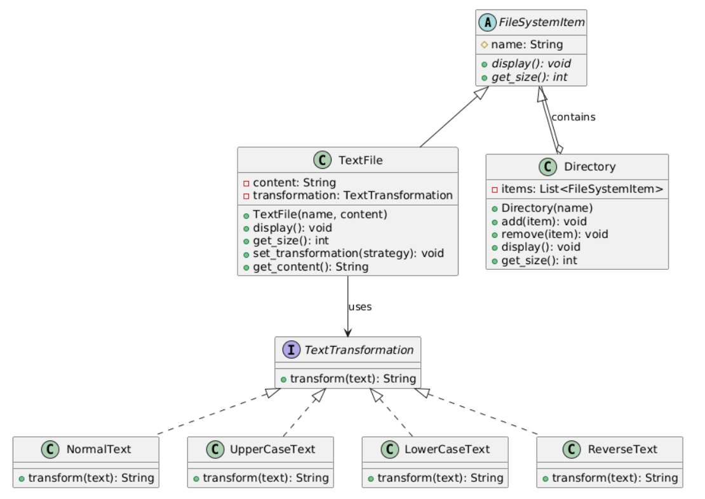
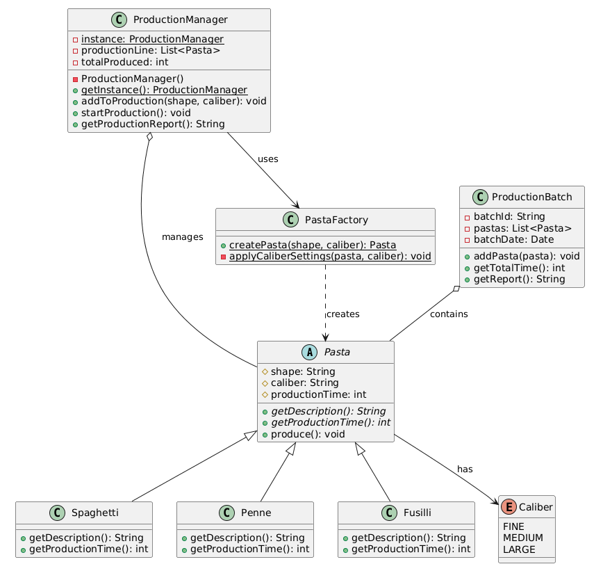
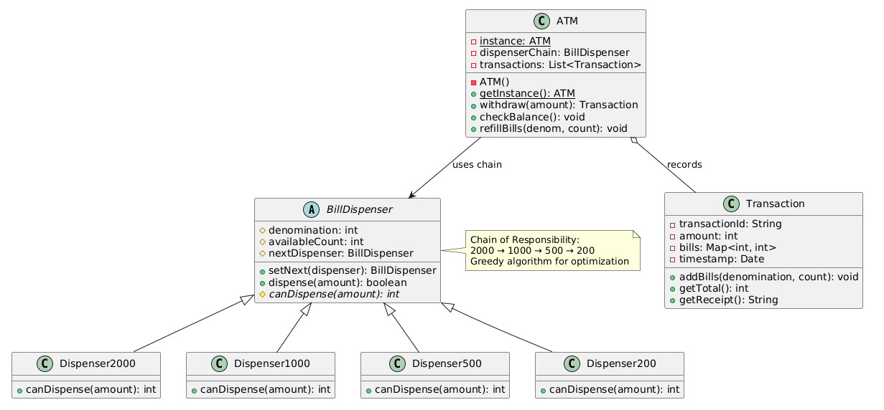

# Task4
We can solve this task using the decorator pattern, which allows us to add as many additives to the coffe as we want.



With this structure we can do the things like:
```python
order = Chocolate(Milk(Espresso()))
```
Or variations like:
```python
# coffe simple
coffee1 = Espresso()
print(f"Order 1: {coffee1.get_description()}")
print(f"Cost: ${coffee1.get_cost()}\n")

# espresso + milk
coffee2 = Espresso()
coffee2 = Milk(coffee2)
print(f"Order 2: {coffee2.get_description()}")
print(f"Cost: ${coffee2.get_cost()}\n")

# blend + milk + chocolate
coffee3 = HouseBlend()
coffee3 = Milk(coffee3)
coffee3 = Chocolate(coffee3)
print(f"Order 3: {coffee3.get_description()}")
print(f"Cost: ${coffee3.get_cost()}\n")

# dark + all additives
coffee4 = DarkRoast()
coffee4 = Milk(coffee4)
coffee4 = Chocolate(coffee4)
coffee4 = Cream(coffee4)
coffee4 = Soy(coffee4)
print(f"Order 4: {coffee4.get_description()}")
print(f"Cost: ${coffee4.get_cost()}\n")

# decafe + double chocolate
coffee5 = Decaf()
coffee5 = Chocolate(coffee5)
coffee5 = Chocolate(coffee5)
print(f"Order 5: {coffee5.get_description()}")
print(f"Cost: ${coffee5.get_cost()}\n")
```

# Task 5
We can make the trasformation as an interface and define the needed essential transformations, also with this design the user can create their own transformations and still use it with our TextFile class.



example:
```python
file1 = TextFile("hello.txt", "Hello World")
file1.set_transformation(UpperCaseText())
file1.set_transformation(ReverseText())
file1.apply_transformation()
```

# Task 6

We use the Singleton pattern for the ProductionManager class to ensure that there is only one static instance managing the production batches. The Factory pattern is used to create different types of pasta based on shape and caliber. Each pasta type is inheriting from an abstract Pasta class.



```python

# Get the singleton instance
manager = ProductionManager.get_instance()

# Add pasta to production
manager.add_to_production("spaghetti", Caliber.MEDIUM)
manager.add_to_production("penne", Caliber.FINE)
manager.add_to_production("fusilli", Caliber.LARGE)

# Start production of the queued pasta
manager.start_production()

# Fill a new batch queue
manager.add_to_production("penne", Caliber.FINE)
manager.add_to_production("penne", Caliber.MEDIUM)

# second batch
manager.start_production()

# Get full report
manager.get_production_report()
```

# Task 7
We use the Chain of Responsibility pattern to handle the bill dispensing logic. Each dispenser is responsible for a specific denomination, if it can't dispense the lesser denomination, it will call the next dispenser in the chain.



We can make a dispenser chain like this:
```python
dispenser2000 = Dispenser2000(5)  # 5 bills of 2000
dispenser500 = Dispenser500(10)    # 10 bills of 500
dispenser200 = Dispenser200(20)    # 20 bills of 200
dispenser2000.set_next(dispenser500)
dispenser500.set_next(dispenser200)

# give it the head of the chain(largest first)
atm = ATM.get_instance()
atm.set_dispenser_chain(dispenser2000) 

txn1 = atm.withdraw(4700)
if txn1:
    print(txn1.get_receipt())
```

```
The output will be:
```Transaction Receipt
Transaction ID: 1
Date: 2024-06-14 12:00:00
Amount Withdrawn: 4700
Bills Dispensed:
2000 x 2
500 x 1
200 x 1
```
